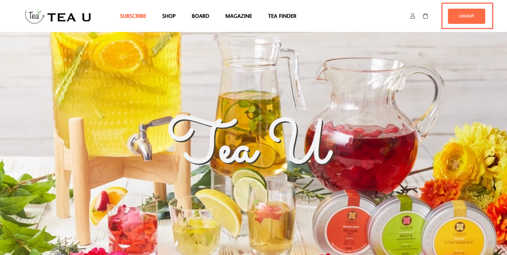
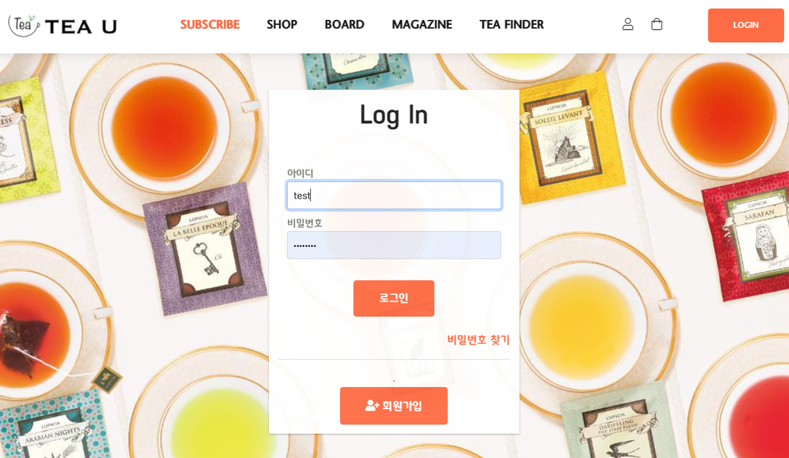
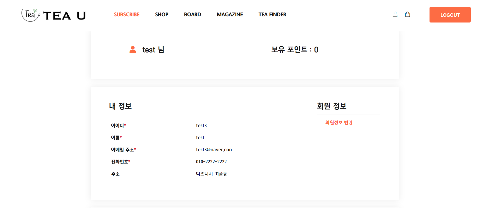

# TeaU

- 팀 명 : Acha?!
- 참여인원 : 7인
- 개발기간 : 5.24(월)~7.14(수)
- 개발환경 : JAVA, 오라클, Spring framework, Mybatis
- 개요 : Spring framework MVC 쇼핑몰 프로젝트 


____

## DB
Click [AQUERY ERD](https://aquerytool.com/aquerymain/index/?rurl=b5b8f417-40c2-4a4e-adcb-bf19dd4ed1dd&/)
Password : uta48r

___

## 홈페이지 상세
<br>

### 1. 메인 화면



### 2. 로그인


- 로그인 후, 로그인한 회원 정보 header에 저장(Ajax)
```js
function getMemberInfo() {
	$.ajax({
		type : 'POST',
		url : 'getMemberInfo.do',
		
		success : function(data) {
			var obj = JSON.parse(data);
			sessionCheck(obj);
		},
		error : function(e) {
			console.log(e);
		}
	});
}
```
```java
@Controller
public class CommonController {
	@RequestMapping("/getMemberInfo.do")
	@ResponseBody
	public String getMemberInfo(HttpServletRequest request) throws JsonProcessingException{
		HttpSession session = request.getSession();
		MemberVO member = (MemberVO)session.getAttribute("member");
		HashMap<String, Object> hashmap = new HashMap<String, Object>();
		hashmap.put("member", member);
		ObjectMapper mapper = new ObjectMapper();
		String json = mapper.writerWithDefaultPrettyPrinter().writeValueAsString(hashmap);
		System.out.println(json);
		return json;
	}

}
```
- 로그인 여부에 따라 헤더 [login] [logout] 버튼 변경
- 비로그인 상태에서 마이페이지 누르면 로그인 페이지로 이동

### 3. 마이페이지


#### - 회원정보 변경

- 카카오맵 주소 Api 사용
  
<br>

- 비밀번호 체크
<br>
<br>

- 회원정보 변경 후
  <br>

### 4. 구독
____

- 1인 1구독 구현 : MEMBER 테이블에 MEMBER_SUB 컬럼 추가

#### 1) 구독 메인페이지
<br>

#### 2) 나무구독
- 10개까지 선택 가능(베이스 3개까지)
<br>

- 추가 선택에 따라 가격변동
<br>

- 카카오 결제 api
<br>

#### 3) 결제 후 마이페이지 구독 정보
<br>
취향선택 태그 출력
```js
         // 구독 내역 없을 시 구독정보 박스 숨기기
         console.log("${sub.orderCate}");
         if ("${sub.orderCate}" == "") {
            //document.getElementByid("subscribe_order").sytle.display="none";
            $("#subscribe_order").hide();

         } else {
            //document.getElementByid("subscribe_order").sytle.display="none";
            $("#subscribe_order").show();

         }
         
         // 취향선택 태그
         //let str = "";
         
         let tagSeason;
         let tagBase;
         let tagDrink;
         let tagBlend;
         let tagTaste;
         let tagCaff;
         let tagEffect;
         let treeSelect; 
         
         tea_tag(tagSeason, "${sub.tagSeason}");
         tea_tag(tagBase, "${sub.tagBase}");
         tea_tag(tagDrink, "${sub.tagDrink}");
         tea_tag(tagBlend, "${sub.tagBlend}");
         tea_tag(tagTaste, "${sub.tagTaste}");
         tea_tag(tagCaff, "${sub.tagCaff}");
         tea_tag(tagEffect, "${sub.tagEffect}");
         tea_tag(treeSelect, "${sub.treeSelect}");
         
         $("#tea_tag").html(str);
         
         
      }) // 도큐멘트레디 종료
      
      //전역변수
      let str = "";
      
      // 구독 취향선택 태그 함수
      function tea_tag(param, string){

    	  if (string != ""){
 	         param = string;
 	       	 param = param.split(',');
 	         
 	         console.log(param);
 	         
 	         for(let i in param){

 	         str += "<a class='tea_tag' href='"+'#'+ "' >";
 	         str += '#'+param[i]; // 태그명
 	         str += "</a>";
 	         
          }
 	         
          }
    	  
      }
```

#### 4) 구독 정보 수정
<br>
- 체크박스 불러와서 다시 화면에 뿌려주도록 Ajax 사용

```java
	// 수정 
	@RequestMapping(value="/treeUpdateLoad.do", produces="application/text; charset=utf8")
	@ResponseBody
	public String updataLoad(@RequestParam Map<String, String> paramMap) throws JsonProcessingException{
		SubVO sub = new SubVO();
		sub.setSubUser(paramMap.get("memberId"));
		
		// subInfo라는 이름으로 유저의 Sub객체 전체를 담는다
		SubVO subInfo = treeService.getSub(sub);
		
		Map<String, Object> hashMap = new HashMap<String, Object>();
		
		hashMap.put("subInfo", subInfo); 
		ObjectMapper mapper = new ObjectMapper(); //데이터 가공
		//자바를 JSON으로 변환
		String json = mapper.writerWithDefaultPrettyPrinter().writeValueAsString(hashMap);
		
		return json;
	}
```
```java
<% 
   String data =  request.getParameter("data"); //data 를 String 으로 변환 
%> 
```
```js
      // 업데이트 시 기존 사용자의 선택 불러오기(오류 수정)
      let data = <%=data%>;
      console.log(data);
      
      if(data != null){
         //stirng을 다시 JSON 객체로 변환
         let obj = JSON.parse(data);
         console.log(obj);
         
         let treeSelect = obj['subInfo'].treeSelect.split(',');
         let treeAdd = obj['subInfo'].treeAdd; 
         
         if(treeAdd != null){     
         treeAdd = treeAdd.split(',');
         }
         let treeReq = obj['subInfo'].treeReq;
         let subPrice = obj['subInfo'].subPrice;


         // 요청사항
         $('#treeReq').val(treeReq);
         // 총가격
         $('#totalPrice').val(subPrice);
         
         // 아이템 선택 뿌려주기
         $('input:checkbox[name="treeSelect"]').each(function(){
            for(let i=0 ; i< treeSelect.length ; i++){               
               if(this.value == treeSelect[i]){
                  this.checked = true;
               }
            } 
          });
```

### 5. 상품
____

도록 Ajax 사용