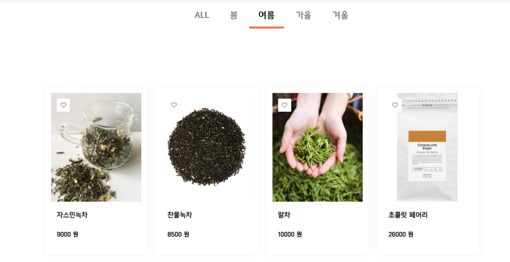
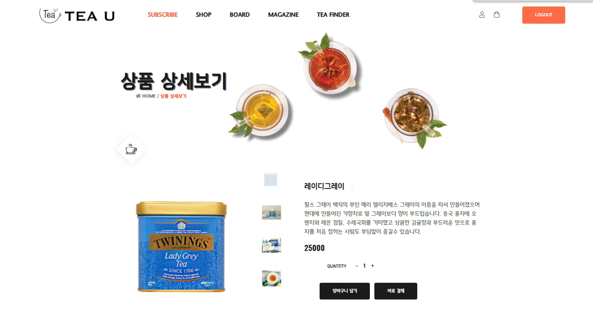
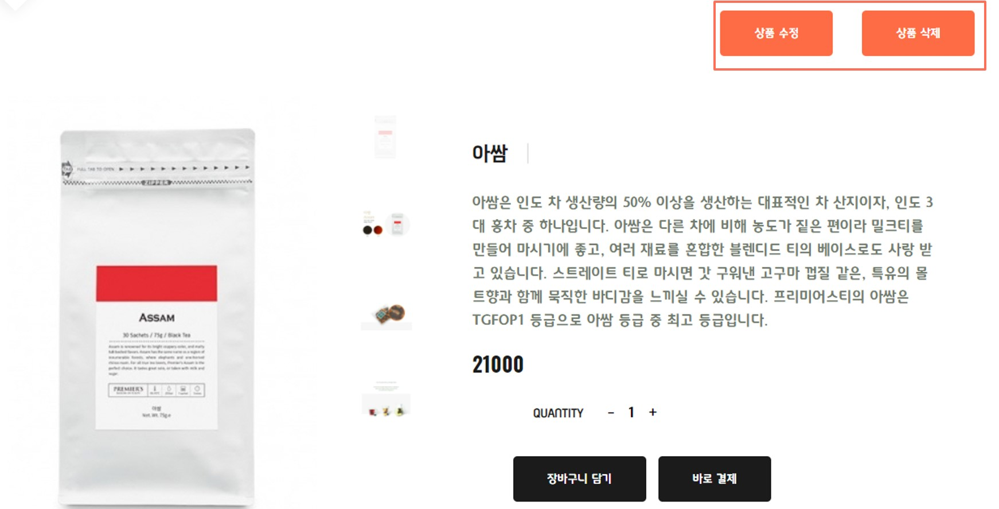
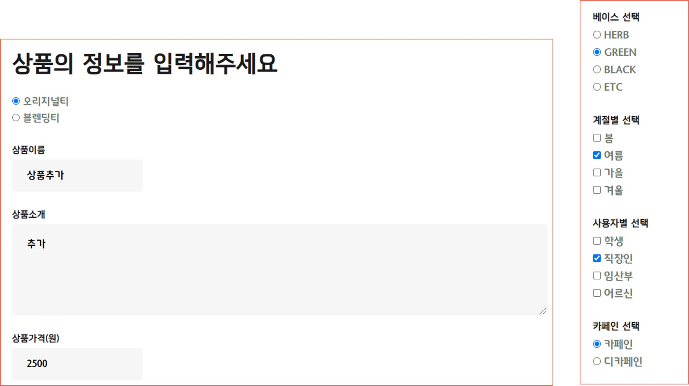
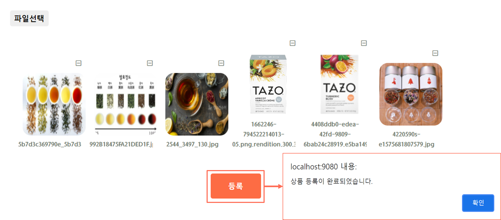
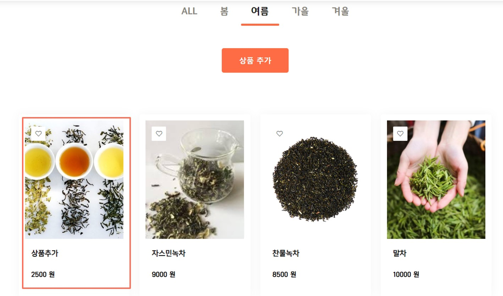
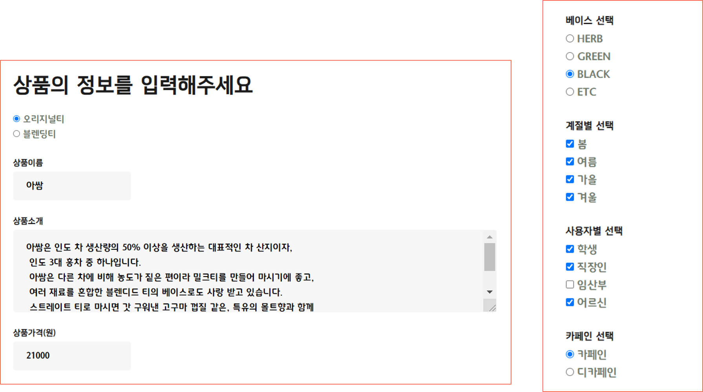

# TeaU

- 팀 명 : Acha?!
- 참여인원 : 7인
- 개발기간 : 5.24(월)~7.14(수)
- 개발환경 : JAVA, 오라클, Spring framework, Mybatis
- 개요 : Spring framework MVC 쇼핑몰 프로젝트 


____

## DB
Click [AQUERY ERD](https://aquerytool.com/aquerymain/index/?rurl=b5b8f417-40c2-4a4e-adcb-bf19dd4ed1dd&/)
Password : uta48r


___

## 홈페이지 상세
<br>

### 1. 메인 화면


### 2. 로그인


- 로그인 후, 로그인한 회원 정보 header에 저장(Ajax)

> header.jsp
```js
<script type = "text/javascript">
$(document).ready(function(){
   getMemberInfo();
});

// 전역변수 선언
let id = '';
let role = '';
// 세션체크 JSON 전송
function sessionCheck(obj) {
   if (obj["member"] != null) {
      id = obj["member"].memberId;
      role = obj["member"].memberRole;
      console.log(id);
      console.log(role);
      if (role == '1') {
         $('.admin').show();
      } else {
         $('.admin').hide();
      }

   } else {
      id = null;
      console.log(id);
      if (role == '1') {
         $('.admin').show();
      } else {
         $('.admin').hide();
      }

   }
}
</script>
```
>com_lib.js
```js
function getMemberInfo() {
	$.ajax({
		type : 'POST',
		url : 'getMemberInfo.do',
		
		success : function(data) {
			var obj = JSON.parse(data);
			sessionCheck(obj);
		},
		error : function(e) {
			console.log(e);
		}
	});
}
```
>CommonController.java
```java
@Controller
public class CommonController {
	@RequestMapping("/getMemberInfo.do")
	@ResponseBody
	public String getMemberInfo(HttpServletRequest request) throws JsonProcessingException{
		HttpSession session = request.getSession();
		MemberVO member = (MemberVO)session.getAttribute("member");
		HashMap<String, Object> hashmap = new HashMap<String, Object>();
		hashmap.put("member", member);
		ObjectMapper mapper = new ObjectMapper();
		String json = mapper.writerWithDefaultPrettyPrinter().writeValueAsString(hashmap);
		System.out.println(json);
		return json;
	}

}
```
- 로그인 여부에 따라 헤더 [login] [logout] 버튼 변경
- 관리자/일반회원/정지회원 구분 위해 MEMBER 테이블에 MEMBER_ROLE 컬럼 추가
- 비로그인 상태에서 마이페이지 버튼 > 로그인 페이지로 이동
- 로그인 상태에서 마이페이지 버튼 > 관리자는 admin.do로, 일반회원은 mypage.do로 이동
- 정지회원은 로그인 불가능


### 3. 마이페이지

  - 회원정보
  - 구독정보
  - 상품구매정보


#### - 회원정보 변경

- 카카오맵 주소 Api 사용
> mypage_edit.jsp
```jsp
<!-- 우편번호 히든  -->
<input type="hidden" id="sample4_postcode" placeholder="우편번호" accept-charset="EUC-KR" readonly><label for="adress"></label>
<input type="text" id="sample4_roadAddress" name="memberAddress"
placeholder="주소를 입력해주세요" style="width:250px;border:none;" accept-charset="EUC-KR" value="${member.memberAddress }" readonly>
                                    
<input type="text" name="memberAddress" placeholder="상세주소를 입력해 주세요"
accept-charset="EUC-KR" style="width:250px;border:none;" value="">
<button type="button" class="btn-outline-primary"
onclick="sample4_execDaumPostcode()" style="color:#fd6c44;padding:5px;">주소검색</button>
```
> mypage_edit.jsp
```js
<script language="JavaScript"
   src="//t1.daumcdn.net/mapjsapi/bundle/postcode/prod/postcode.v2.js"
   charset="UTF-8"></script>
<script charset="utf-8">
   function sample4_execDaumPostcode() {
      new daum.Postcode(
            {
               oncomplete : function(data) {
                  // 팝업에서 검색결과 항목을 클릭했을때 실행할 코드를 작성하는 부분.

                  // 도로명 주소의 노출 규칙에 따라 주소를 표시한다.
                  // 내려오는 변수가 값이 없는 경우엔 공백('')값을 가지므로, 이를 참고하여 분기 한다.
                  var roadAddr = data.roadAddress; // 도로명 주소 변수
                  var extraRoadAddr = ''; // 참고 항목 변수

                  // 법정동명이 있을 경우 추가한다. (법정리는 제외)
                  // 법정동의 경우 마지막 문자가 "동/로/가"로 끝난다.
                  if (data.bname !== '' && /[동|로|가]$/g.test(data.bname)) {
                     extraRoadAddr += data.bname;
                  }
                  // 건물명이 있고, 공동주택일 경우 추가한다.
                  if (data.buildingName !== '' && data.apartment === 'Y') {
                     extraRoadAddr += (extraRoadAddr !== '' ? ', '
                           + data.buildingName : data.buildingName);
                  }
                  // 표시할 참고항목이 있을 경우, 괄호까지 추가한 최종 문자열을 만든다.
                  if (extraRoadAddr !== '') {
                     extraRoadAddr = ' (' + extraRoadAddr + ')';
                  }

                  // 우편번호와 주소 정보를 해당 필드에 넣는다.
                  document.getElementById('sample4_postcode').value = data.zonecode;
                  document.getElementById("sample4_roadAddress").value = roadAddr;
               }
            }).open();
   }
</script>
```
- 비밀번호 체크
<br>
<br>
> mypage_edit.jsp
```js
   $(document).ready(function() {

      //비밀번호 중복체크
      $("#alert-success").hide();
      $("#alert-danger").hide();
      $("input").keyup(function() {
         var pwd1 = $("#pwd1").val();
         var pwd2 = $("#pwd2").val();
         if (pwd1 != "" || pwd2 != "") {
            if (pwd1 == pwd2) {
               $("#alert-success").show();
               $("#alert-danger").hide();
               $("#editSubmit").removeAttr("disabled");
            } else {
               $("#alert-success").hide();
               $("#alert-danger").show();
               $("#editSubmit").attr("disabled", "disabled");
            }
         }
      });

   });
```

- 회원정보 변경 후
  <br>

### 4. 구독
____

- 1인 1구독 구현 : MEMBER 테이블에 MEMBER_SUB 컬럼 추가

#### 1) 구독 메인페이지
<br>

#### 2) 나무구독
- forEach문과 if문을 사용해 나무 구독 상품 출력(6.22 추가)
  -treeServiceImpl에 getTeaList 추가

- 10개까지 선택 가능(베이스 3개까지)
<br>

- 추가 선택에 따라 가격변동(6.22 추가)
<br>
* 고민해볼 점 : 추가 상품이 늘어날 경우를 대비해 체크리스트를 동적으로 생성하는 방법

- 카카오 결제 api
<br>
> subscribe_tree.jsp
```js
    // 카카오 구매 API
    function checkModule() {
  	  var Imp = window.IMP;
  	  let price = $('#totalPrice').val();
 
    //let Imp = window.IMP;
    IMP.init('imp45072851');
    
    IMP.request_pay({
        pg : 'kakaopay', // version 1.1.0부터 지원.
        pay_method : 'kakaopay',
        merchant_uid : "${sub.subDate}",
        name : '나무 구독 결제', // 상품명
        amount : price, // 상품가격
        buyer_email : "${member.memberEmail}", // 구매자 이메일
        buyer_name : "${member.memberName}", // 구매자 이름
        buyer_tel : "${member.memberPhone}", // 구매자 연락처
        buyer_addr : "${member.memberAddress}", // 구매자 주소
    }, function(rsp) {
        if ( rsp.success ) {
           
                  var msg = '결제가 완료되었습니다.';
                  msg += '고유ID : ' + rsp.imp_uid;
                  msg += '상점 거래ID : ' + rsp.merchant_uid;
                  msg += "가격:" + rsp.paid_amount;
                  msg += '카드 승인번호 : ' + rsp.apply_num;
                  
                  $.ajax({
  					type : 'POST',
  					url : 'insertSubTree.do',
  					dataType : 'text',// form에 있는 데이터들을 controller로 text타입으로 
  					data : $('#tree_form').serialize(),
  					success : function(data) {
  						alert(data);
  						window.location.href = ("mypage.do"); //JSP 이동 페이지 적기  
  					},
  					error : function(e) {
  						console.log(e);
  					}
  				});

        } else {
            var msg = '결제에 실패하였습니다.';
            msg += '에러내용 : ' + rsp.error_msg;
        }
        alert(msg);
    });
    
    }
```

#### 3) 결제 후 마이페이지 구독 정보
<br>
취향선택 태그 출력
> mypage.jsp
```js
         // 구독 내역 없을 시 구독정보 박스 숨기기 6.25 추가
         console.log("${sub.orderCate}");
         if ("${sub.orderCate}" == "") {
            //document.getElementByid("subscribe_order").sytle.display="none";
            $("#subscribe_order").hide();

         } else {
            //document.getElementByid("subscribe_order").sytle.display="none";
            $("#subscribe_order").show();

         }
         
         // 취향선택 태그
         //let str = "";
         
         let tagSeason;
         let tagBase;
         let tagDrink;
         let tagBlend;
         let tagTaste;
         let tagCaff;
         let tagEffect;
         let treeSelect; 
         
         tea_tag(tagSeason, "${sub.tagSeason}");
         tea_tag(tagBase, "${sub.tagBase}");
         tea_tag(tagDrink, "${sub.tagDrink}");
         tea_tag(tagBlend, "${sub.tagBlend}");
         tea_tag(tagTaste, "${sub.tagTaste}");
         tea_tag(tagCaff, "${sub.tagCaff}");
         tea_tag(tagEffect, "${sub.tagEffect}");
         tea_tag(treeSelect, "${sub.treeSelect}");
         
         $("#tea_tag").html(str);
         
         
      }) // 도큐멘트레디 종료
      
      //전역변수
      let str = "";
      
      // 구독 취향선택 태그 함수
      function tea_tag(param, string){

    	  if (string != ""){
 	         param = string;
 	       	 param = param.split(',');
 	         
 	         console.log(param);
 	         
 	         for(let i in param){

 	         str += "<a class='tea_tag' href='"+'#'+ "' >";
 	         str += '#'+param[i]; // 태그명
 	         str += "</a>";
 	         
          }
 	         
          }
    	  
      }
```

#### 4) 구독 정보 수정
<br>
- data값의 유무로 insert/update 구분
> subscribe_tree.jsp
```java
<% 
   String data =  request.getParameter("data"); //data 를 String 으로 변환 
%> 
```
- 체크박스 불러와서 다시 화면에 뿌려주도록 Ajax 사용

> SubController.java
```java
	// 수정 
	@RequestMapping(value="/treeUpdateLoad.do", produces="application/text; charset=utf8")
	@ResponseBody
	public String updataLoad(@RequestParam Map<String, String> paramMap) throws JsonProcessingException{
		SubVO sub = new SubVO();
		sub.setSubUser(paramMap.get("memberId"));
		
		// subInfo라는 이름으로 유저의 Sub객체 전체를 담는다
		SubVO subInfo = treeService.getSub(sub);
		
		Map<String, Object> hashMap = new HashMap<String, Object>();
		
		hashMap.put("subInfo", subInfo); 
		ObjectMapper mapper = new ObjectMapper(); //데이터 가공
		//자바를 JSON으로 변환
		String json = mapper.writerWithDefaultPrettyPrinter().writeValueAsString(hashMap);
		
		return json;
	}
```
> subscribe_tree.jsp
```js
      // 업데이트 시 기존 사용자의 선택 불러오기(오류 수정)
      let data = <%=data%>;
      console.log(data);
      
      if(data != null){
         //stirng을 다시 JSON 객체로 변환
         let obj = JSON.parse(data);
         console.log(obj);
         
         let treeSelect = obj['subInfo'].treeSelect.split(',');
         let treeAdd = obj['subInfo'].treeAdd; 
         
         if(treeAdd != null){     
         treeAdd = treeAdd.split(',');
         }
         let treeReq = obj['subInfo'].treeReq;
         let subPrice = obj['subInfo'].subPrice;


         // 요청사항
         $('#treeReq').val(treeReq);
         // 총가격
         $('#totalPrice').val(subPrice);
         
         // 아이템 선택 뿌려주기
         $('input:checkbox[name="treeSelect"]').each(function(){
            for(let i=0 ; i< treeSelect.length ; i++){               
               if(this.value == treeSelect[i]){
                  this.checked = true;
               }
            } 
          });
```

### 5. 상품
____

1) 상품 리스트 출력
- 태그별 정렬 기능 
  
  <br>- forEach, set, if문 사용
  > shopSeason.jsp
   ```jsp
                 <!-- 여름 -->
               <div class="row">
                  <c:forEach items="${shopSeason}" var="tea">
                     <c:set var="season" value="${tea.tagSeason }" />
                     <c:if test="${fn:contains(season, '여름')}">
                        <div class="col-lg-3 col-md-6 col-sm-6">
                           <div class=" wow recipe_item_grid grid fadeInUp">
                              <div class="element-item summer " data-category="summer">
                                 <!-- <form action="/shop_details.do" method="POST"> -->
                                 <div class="shop_card wow fadeInUp" data-wow-delay=".4s">
                                    <a class="wishlist_btn" href="#!"><i
                                       class="fal fa-heart"></i></a>
                                    <form>
                                       <a class="item_image" href="shopDetails.do?teaId=${tea.teaId }">
                                          
                                       </a>
                                       <div class="item_content">
                                          <h3 class="item_title text-uppercase">
                                             <a href="shopDetails.do?teaId=${tea.teaId }" style="font-family: 'InfinitySans-RegularA1';">
                                                ${tea.teaName} </a>
                                             <%-- <input type="button" id="detail" onclick="detail()"> ${tea.teaName} --%>
                                          </h3>
                                          <div>
                                             <p class=""
                                                style="font-family: 'InfinitySans-RegularA1'; font-size: 1rem; color: black; font-weight: bold">${tea.teaPrice}
                                                원</p>
                                             </a>
                                          </div>
                                       </div>
                                    </form>
                                 </div>
                              </div>
                           </div>
                        </div>
                     </c:if>
                  </c:forEach>
               </div>
   ```

2) 상품 상세보기 - 일반회원& 비로그인


3) 상품 관리  - 관리자계정 로그인 시 사용가능

- 상품 추가
  
  첨부파일
  
  상품 등록 완료 후
  
- 상품 수정 화면
  
  기존 데이터 불러오기
  >shopAdmin.jsp
```
// 값 불러오기
            let teaName = obj['shopInfo'].teaName;
            $("#teaName").val(teaName);
            console.log(teaName);

            let teaInfo = obj['shopInfo'].teaInfo;
            $("#teaInfo").val(teaInfo);

            let teaPrice = obj['shopInfo'].teaPrice;
            $("#teaPrice").val(teaPrice);

            // 값 불러오는 것 (체크박스, 라디오박스)
            let tagSeason = obj['shopInfo'].tagSeason.split(',');
            let tagUser = obj['shopInfo'].tagUser.split(',');
            let tagBase = obj['shopInfo'].tagBase;

            $('input:radio[name="orderCate"]').each(function() {
               var cate = $(this);
               if (cate.val() == orderCate)
                  cate.attr('checked', true);
            });

            $('input:checkbox[name="tagSeason"]').each(function() {
               for (let i = 0; i < tagSeason.length; i++) {
                  if (this.value == tagSeason[i]) {
                     this.checked = true;
                  }
               }
            });
            $('input:checkbox[name="tagUser"]').each(function() {
               for (let i = 0; i < tagUser.length; i++) {
                  if (this.value == tagUser[i]) {
                     this.checked = true;
                  }
               }
            });
            $('input:radio[name="tagBase"]').each(function() {
               var base = $(this);
               if (base.val() == tagBase)
                  base.attr('checked', true);

            });

            // TO
            if (orderCate == "TO") {

               let tagCaff = obj['shopInfo'].tagCaff;
               let tagTaste = obj['shopInfo'].tagTaste.split(',');
               let tagEff = obj['shopInfo'].tagEff.split(',');

               $('input:radio[name="tagCaff"]').each(function() {
                  var caff = $(this);
                  if (caff.val() == tagCaff)
                     caff.attr('checked', true);

               });
               $('input:checkbox[name="tagTaste"]').each(function() {
                  for (let i = 0; i < tagTaste.length; i++) {
                     if (this.value == tagTaste[i]) {
                        this.checked = true;
                     }
                  }
               });
               $('input:checkbox[name="tagEff"]').each(function() {
                  for (let i = 0; i < tagEff.length; i++) {
                     if (this.value == tagEff[i]) {
                        this.checked = true;
                     }
                  }
               });

               // TB
            } else {
               let tagBlend = obj['shopInfo'].tagBlend.split(',');
               let tagDrink = obj['shopInfo'].tagDrink.split(',');

               $('input:checkbox[name="tagBlend"]').each(function() {
                  for (let i = 0; i < tagBlend.length; i++) {
                     if (this.value == tagBlend[i]) {
                        this.checked = true;
                     }
                  }
               });
               $('input:checkbox[name="tagDrink"]').each(function() {
                  for (let i = 0; i < tagDrink.length; i++) {
                     if (this.value == tagDrink[i]) {
                        this.checked = true;
                     }
                  }
               });
            }
  ```
  이미지 미리보기
   >shopAdmin.jsp
  ```
        // 첨부파일 이미지 미리보기
      function handleImgFile(e){
         let files = e.files;
         let arr = Array.prototype.slice.call(files);
         
         arr.forEach(function(f) {
            
            if(!f.type.match("image.*")){
               alert("이미지 파일만 업로드 가능합니다");
               return;
            }
            
            //preview(arr);
            
            //추가하려는 값
            //console.log("f:"+f); // object 파일(배열내 각 요소)  
            
            //이미지 배열에 추가
            img_files.push(f);
            console.log("현재 이미지 배열:"+img_files);

            idx = img_files.indexOf(f);
            //idx = img_files.length -1; // 배열 길이 - 1
            // let originalFileName = f.name; 첨부파일의 진짜 이름
            let teaName = $('#teaName').val();
            let fileName = f.name;
            let idxN = idx; // 담아두지 않으면 reder에서 idx값이 최종값으로 고정
            
            console.log(fileName);
            console.log(idx);
            
            let reader = new FileReader();
            
            //미리보기 창 html
            reader.onload = function(e){
               let preImg = "";
               preImg += '<label><div class="imgblock" style="display:inline-block;" id="imgblock_' + img_files.indexOf(f) + '" onclick="deleteImg(' + img_files.indexOf(f) + ')">';
               preImg += '<div class="removeIcon"><i class="far fa-minus-square"></i></div>';
               preImg += '</label>';
               preImg += '<div class="imgName" style="width: 150px; overflow:hidden;text-align:center;" id="imgName' + img_files.indexOf(f) + '">'+ fileName +'</div></div>';

               $(".imgs_wrap").append(preImg);
               
               
            }
            
            //index++;
            console.log(img_files);
            //파일의 URL 읽어서 img src를 url로 지정하는 방식 : 없으면 미리보기 사용 불가능 바로 띄워주려면 필요함
            reader.readAsDataURL(f);
            
         });
         
      } // function handleImgFile(e)

      //미리보기 이미지 삭제
      function deleteImg(num){
         
         
         num = parseInt(num);
         console.log("선택인덱스:" + num);
         //파일 배열에서 제거 : 문제 - 생성시 기준으로 번호를 받아오다보니 삭제 후에 배열 순서가 변함
         console.log($('#imgName' + num).text());
         for(var i = 0; i < img_files.length; i++) {
            console.log(img_files[i].name);
            if(img_files[i].name == $('#imgName' + num).text()) {
               img_files.splice(i, 1);
               i--;
            }
         }
         
         let imgblock = "#imgblock_" + num;
         
         //미리보기 창에서 제거
         $(imgblock).remove();   
         
   /*       $(this).parent('.imgblock').remove(); */
         //let files = $('#uploadFile').val();

         //let files = document.getElementsByName("uploadFile");
   /*       files[idx].select();
           document.selection.clear(); */
         console.log("현재 이미지 배열:"+img_files);
         
      }
  ```
  >shopController.jsp
  ```java
   // 첨부파일 목록 반환(상품번호를 이용해 첨부파일 데이터 Json으로 반환)
      @GetMapping("/getAttachList.do")
      @ResponseBody
      public List<ShopVO> getImgFileList(ShopVO vo){
         return shopService.getImg(vo);
      }
}
```
___ 
## 수정 필요
1. 최종발표한 팀프로젝트 파일에 합치는 과정에서 빠진 부분 돌아가도록 추가
   - 수정 시 이미지 미리보기(구현성공) + 기존 파일 불러와서 이미지 추가해 수정할 수 있도록 변경
   - 회원가입 중복아이디 체크
   - jsp 파일 폴더 정리
2. 추가해보고 싶은 부분
   - 상품 검색 기능
   - 상품 페이징 기능
   - 상품 개별 리뷰 