# TeaU

- 팀 명 : Acha?!
- 참여인원 : 7인
- 개발기간 : 5.24(월)~7.14(수)
- 개발환경 : JAVA, 오라클, Spring framework, Mybatis
- 개요 : Spring framework MVC 쇼핑몰 프로젝트 

____

## DB
Click [AQUERY ERD](https://aquerytool.com/aquerymain/index/?rurl=b5b8f417-40c2-4a4e-adcb-bf19dd4ed1dd&/)
Password : uta48r

___

## 홈페이지 상세
 

### 1. 메인 화면

### 2. 로그인

- 로그인 후, 로그인한 회원 정보 header에 저장(Ajax)
- 로그인 여부에 따라 헤더 [login] [logout] 버튼 변경
- 비로그인 상태에서 마이페이지 누르면 로그인 페이지로 이동

### 3. 마이페이지

#### - 회원정보 변경

- 카카오맵 주소 Api 사용

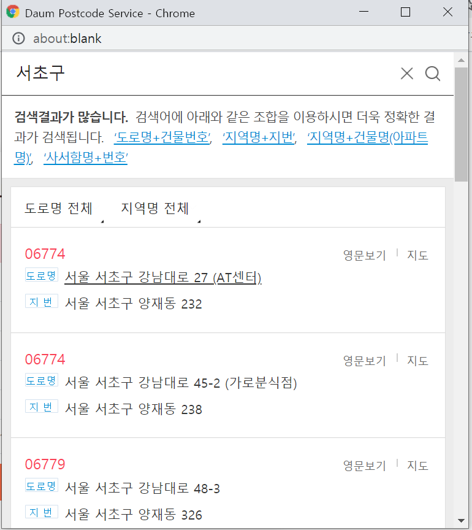

- 비밀번호 체크
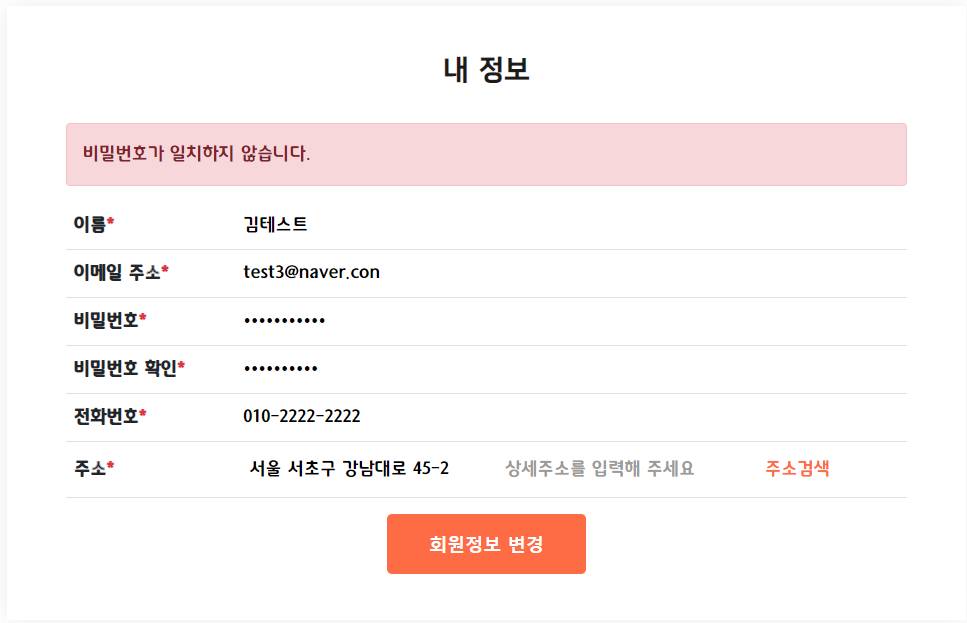
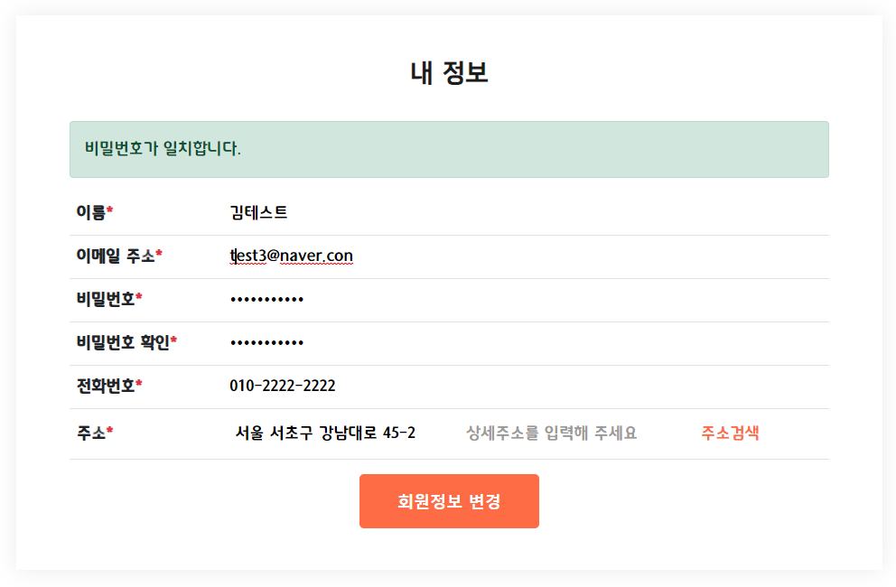

- 회원정보 변경 후
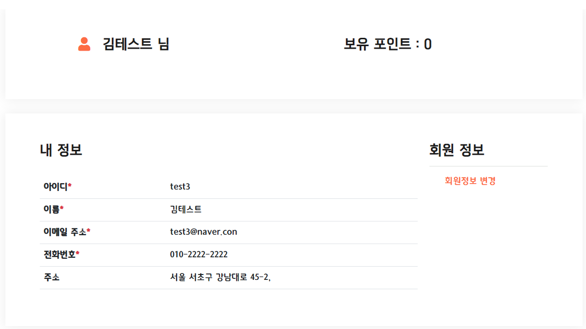

### 4. 구독
____

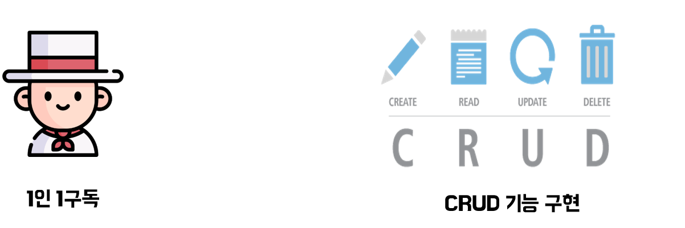
- 1인 1구독 구현 : MEMBER 테이블에 MEMBER_SUB 컬럼 추가

#### 구독 메인페이지
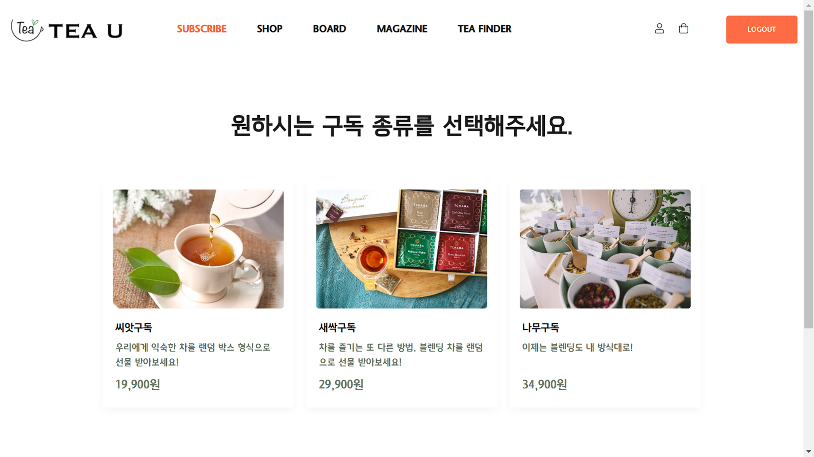

#### 나무구독
- 10개까지 선택 가능(베이스 3개까지)
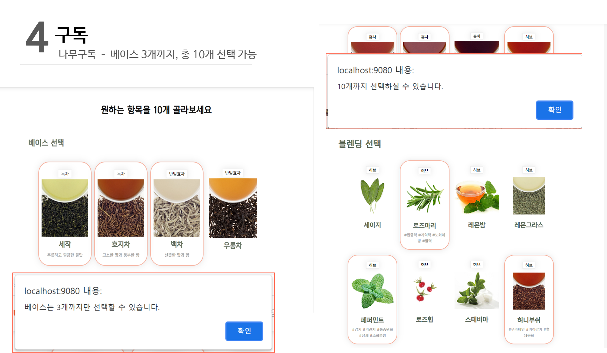

- 추가 선택에 따라 가격변동
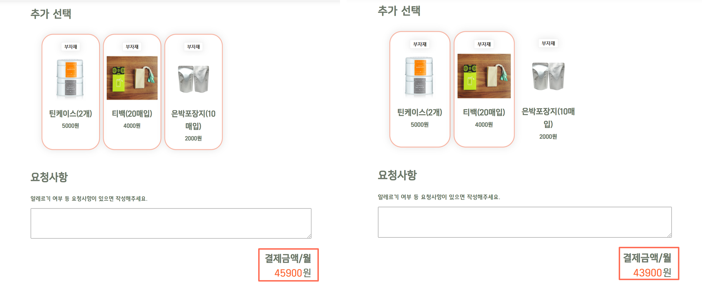

- 카카오 결제 api
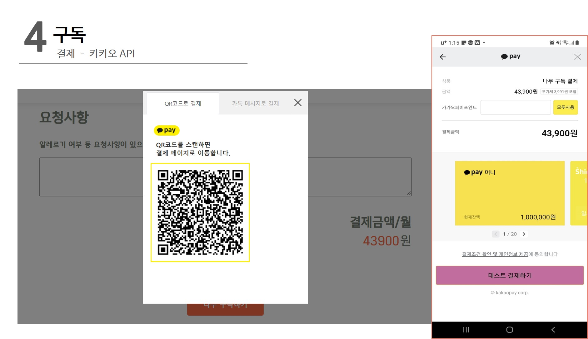

- 결제 후 마이페이지 구독 정보
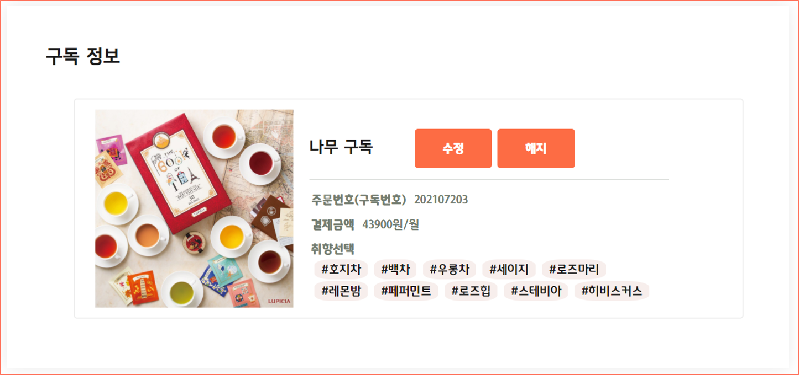
취향선택 태그 출력

- 구독 정보 수정
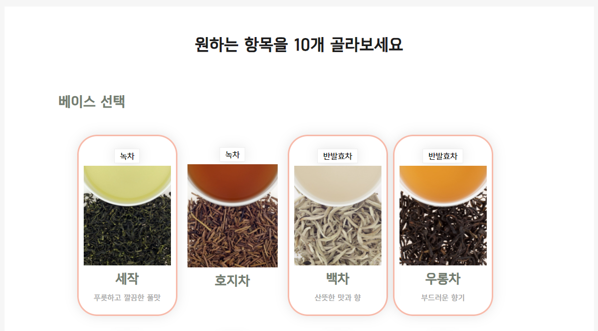
체크박스 불러와서 다시 화면에 뿌려주도록 Ajax 사용
